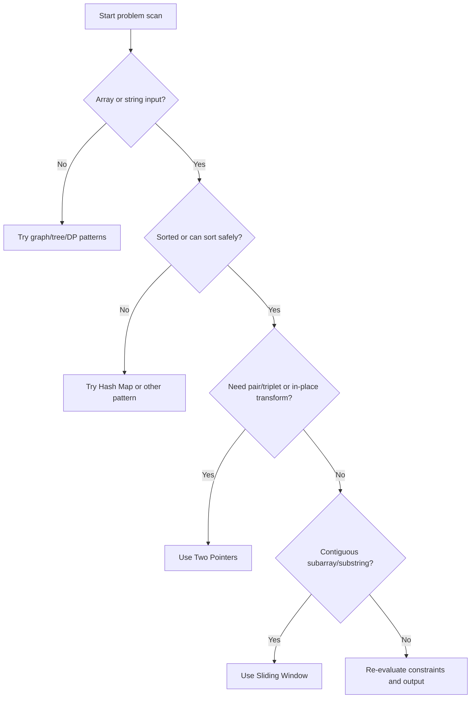
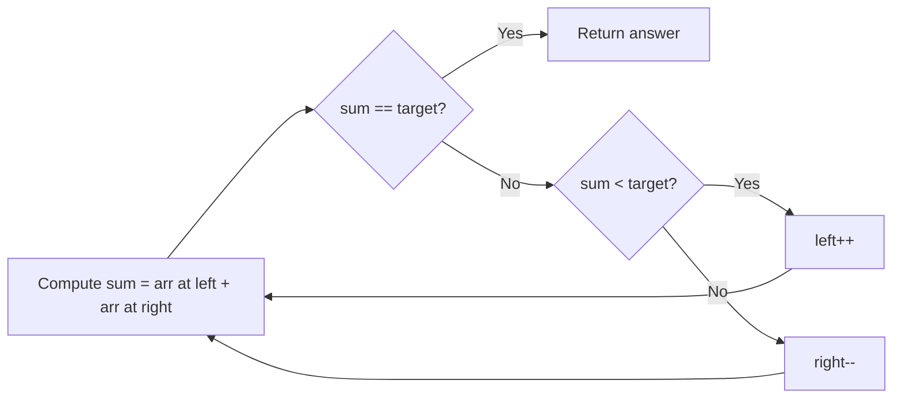

# Pattern 3 — Two Pointers

**Category:** Array/String · **Difficulty Band:** Easy–Hard

---

## ✨ Premium Snapshot

Think of this pattern as a luxury valet system for arrays: two smart workers start from strategic positions and move only when the logic tells them to. No chaos. No random guessing. No O(n²) regret.

---

## 🎯 Pattern Fingerprint

Use Two Pointers when:
- Input is **sorted** (or sorting makes pointer moves meaningful)
- You need a **pair/triplet/group** with sum/difference constraints
- You need **in-place updates** (remove duplicates, partitioning, reversing)
- You compare from **both ends** or track **read/write** positions

Typical phrases:
- *"sorted array"*
- *"two sum"*
- *"remove duplicates in-place"*
- *"3Sum"*
- *"palindrome"*

Do not use this blindly when:
- Input is unsorted and direction is not predictable (prefer Hash Map)
- Problem is contiguous window optimization (prefer Sliding Window)

---

## 🧠 Intuition (Easy + Sticky)

Imagine this scene:
- Left pointer is the optimistic friend: "We need a bigger sum, move me right!" 😄
- Right pointer is the realistic friend: "Too much sum, move me left." 😎

Because the data is sorted, each move has a predictable effect.
That predictability is the whole superpower.

No nested loops, no drama: each pointer moves at most n times.

---

## 🗺️ Flowchart: Should I Use Two Pointers?



---

## 🎬 Flowchart: Two-Sum Pointer Movement



---

## 🔮 Prediction Checklist

- [ ] Is the array sorted (or should I sort)?
- [ ] Am I searching pair/triplet constraints?
- [ ] Do I need in-place O(1) extra space behavior?
- [ ] Can I justify pointer direction mathematically?

If 2 or more are checked, Two Pointers is likely your best friend 🤝

---

## 📐 Core Template (C++)

```cpp
#include <bits/stdc++.h>
using namespace std;

// 1) Converging pointers on sorted array
vector<int> two_sum_sorted(const vector<int>& arr, int target) {
    int left = 0, right = (int)arr.size() - 1;

    while (left < right) {
        int current = arr[left] + arr[right];

        if (current == target) return {left, right};
        if (current < target) ++left;   // Need a bigger sum
        else --right;                   // Need a smaller sum
    }

    return {};
}

// 2) Same-direction read/write pointers (in-place dedupe)
int remove_duplicates(vector<int>& arr) {
    if (arr.empty()) return 0;

    int write = 1;
    for (int read = 1; read < (int)arr.size(); ++read) {
        if (arr[read] != arr[write - 1]) {
            arr[write++] = arr[read];
        }
    }

    return write;
}

// 3) 3Sum = fix one value + two pointers on remaining range
vector<vector<int>> three_sum(vector<int> nums) {
    sort(nums.begin(), nums.end());
    vector<vector<int>> result;

    for (int i = 0; i + 2 < (int)nums.size(); ++i) {
        if (i > 0 && nums[i] == nums[i - 1]) continue;  // Skip duplicate anchors

        int left = i + 1, right = (int)nums.size() - 1;

        while (left < right) {
            long long total = 1LL * nums[i] + nums[left] + nums[right];

            if (total == 0) {
                result.push_back({nums[i], nums[left], nums[right]});

                while (left < right && nums[left] == nums[left + 1]) ++left;
                while (left < right && nums[right] == nums[right - 1]) --right;

                ++left;
                --right;
            } else if (total < 0) {
                ++left;
            } else {
                --right;
            }
        }
    }

    return result;
}
```

---

## 🧪 Mini Visual Dry Run

Example: `arr = [1,2,4,6,10]`, `target = 8`

| left | right | values | sum | action |
|------|-------|--------|-----|--------|
| 0 | 4 | 1 + 10 | 11 | too big → right-- |
| 0 | 3 | 1 + 6 | 7 | too small → left++ |
| 1 | 3 | 2 + 6 | 8 | found ✅ |

This is why it is O(n): each pointer only moves forward in one direction.

---

## 🔀 Variants You Must Know

| Variant | Pointer Style | Use Case |
|---------|---------------|----------|
| Converging | left↔right | Pair in sorted array |
| Same direction | read→write | In-place compaction |
| Fixed + converging | i fixed + left/right | 3Sum, 4Sum-style reductions |
| Triple partition | low/mid/high | Dutch National Flag |

---

## ⏱️ Complexity

| Task | Brute Force | Two Pointers |
|------|-------------|--------------|
| Pair search | O(n²) | O(n) |
| Triplet search | O(n³) | O(n²) |
| Extra space | O(1) | O(1) |

---

## 🚨 Traps That Kill Submissions

1. Forgetting sort before directional logic.
2. Moving the wrong pointer after comparison.
3. Not skipping duplicates in 3Sum (duplicate outputs).
4. Wrong loop guard:
   - Pair problems usually need `left < right`
   - Some boundary searches may need `<=`

---

## 😄 Memory Hooks

- "Too small? Move left to get rich." 💸
- "Too large? Move right to be polite." 🎩
- "Sorted array = legal pointer moves." ⚖️

If you remember just one thing:
**Pointer movement is not a guess. It is a proof-driven decision.**

---

## 📝 Curated Problem Set

| # | Problem | Difficulty | Key Insight |
|---|---------|------------|-------------|
| 1 | [Valid Palindrome](https://leetcode.com/problems/valid-palindrome/) | 🟢 Easy | Compare from both ends |
| 2 | [Two Sum II - Input Array Is Sorted](https://leetcode.com/problems/two-sum-ii-input-array-is-sorted/) | 🟢 Easy | Classic converging pointers |
| 3 | [Remove Duplicates from Sorted Array](https://leetcode.com/problems/remove-duplicates-from-sorted-array/) | 🟢 Easy | Read/write pointer pattern |
| 4 | [Squares of a Sorted Array](https://leetcode.com/problems/squares-of-a-sorted-array/) | 🟢 Easy | Fill from back with larger abs value |
| 5 | [3Sum](https://leetcode.com/problems/3sum/) | 🟡 Medium | Fix one + two-pointer sweep |
| 6 | [Container With Most Water](https://leetcode.com/problems/container-with-most-water/) | 🟡 Medium | Move shorter wall only |
| 7 | [Sort Colors (Dutch Flag)](https://leetcode.com/problems/sort-colors/) | 🟡 Medium | Three-pointer partition |
| 8 | [Trapping Rain Water](https://leetcode.com/problems/trapping-rain-water/) | 🔴 Hard | Two-sided max tracking |

---

## 🏁 Final One-Liner

Two Pointers is what happens when brute force gets a private tutor, drinks espresso, and starts making mathematically justified moves only. ☕

---
